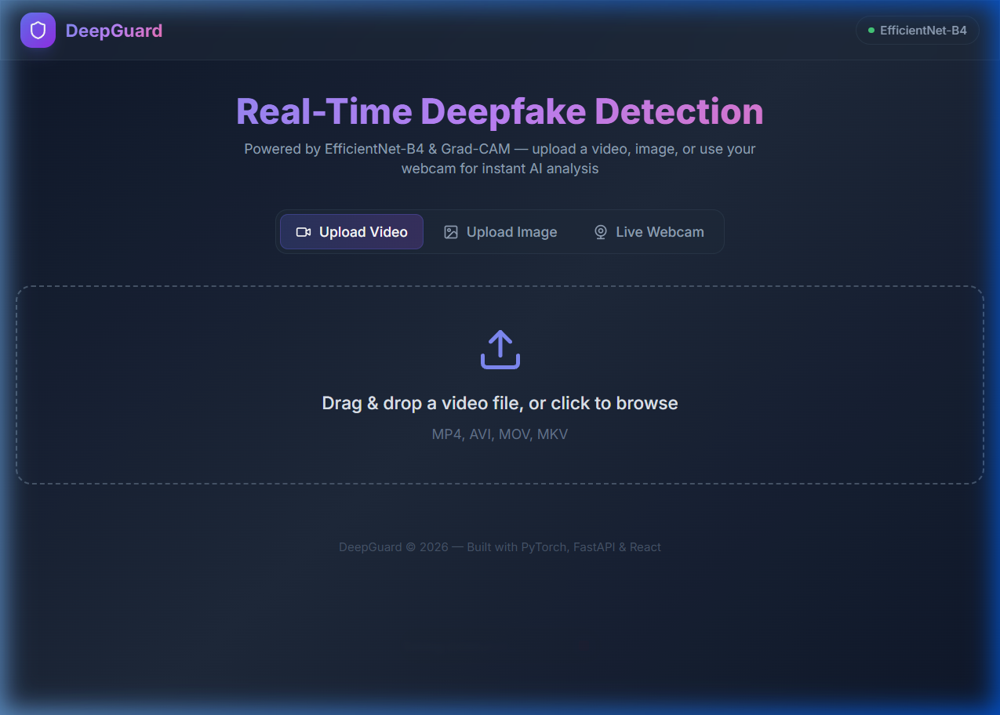
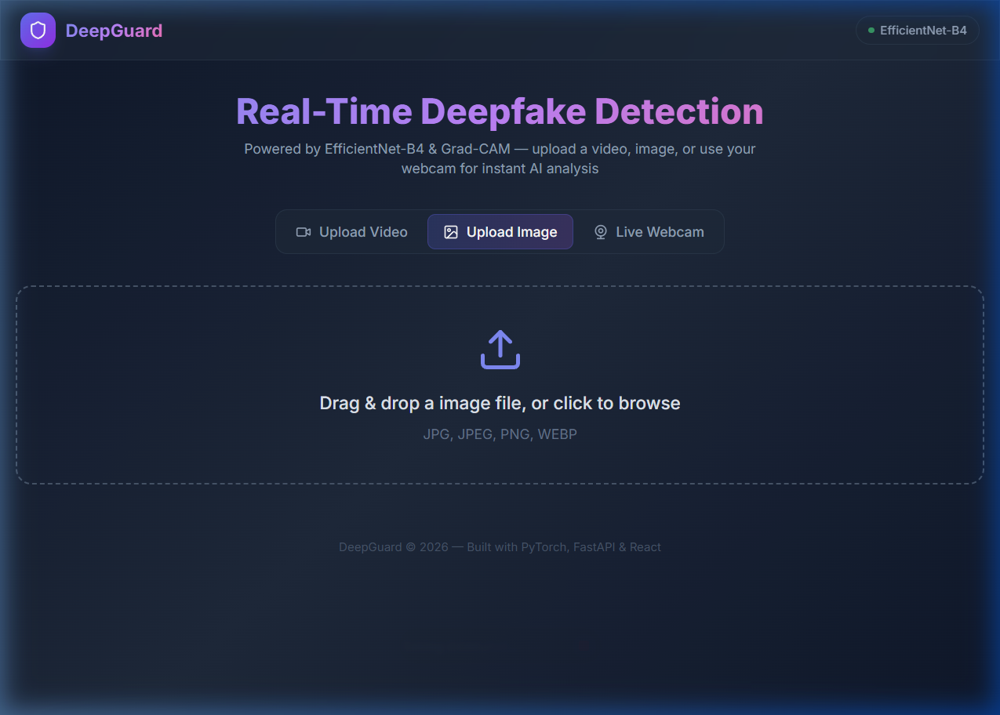
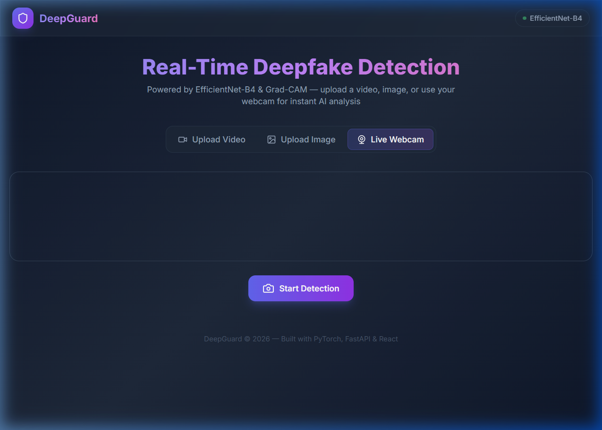
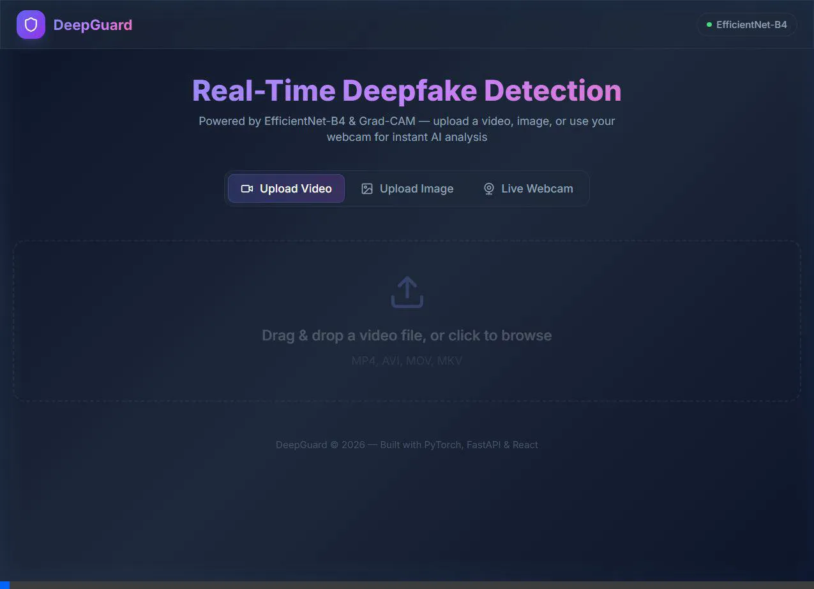

# 🛡️ DeepGuard — Real-Time Deepfake Detection System

A production-ready deepfake detection system powered by **EfficientNet-B4** and **Grad-CAM**.
Upload images, videos, or use your webcam for real-time analysis with explainable AI heatmaps
that highlight manipulated regions.

---

## 📸 Screenshots

### Upload Video


### Upload Image


### Live Webcam Detection


### Demo


---

## 🏗️ Architecture

```
  Video / Image / Webcam
          ↓
  Face Detector (OpenCV Haar)
          ↓
  Frame Extractor (OpenCV)
          ↓
  EfficientNet-B4 Model (timm)
          ↓
  Grad-CAM Heatmap Generator
          ↓
  FastAPI Backend (REST API)
          ↓
  SQLite Result Logging
          ↓
  React Dashboard (Vite + TailwindCSS)
```

---

## ✨ Features

| Feature | Description |
|---------|-------------|
| 🎬 Video Detection | Upload MP4/AVI/MOV/MKV for frame-by-frame analysis |
| 🖼️ Image Detection | Upload JPG/PNG/WEBP for single-image detection |
| 📹 Live Webcam | Real-time detection with verdict overlay |
| 📦 Batch Processing | Analyse multiple files in one request |
| 👤 Face Cropping | Auto-detect and crop faces before analysis |
| 🔥 Grad-CAM Heatmaps | Visual explanations of model focus areas |
| 📊 Result Dashboard | Confidence rings, probability bars, pie charts |
| 🗄️ Database Logging | SQLite persistence for all analysis results |
| 📄 PDF Reports | Downloadable visual analysis reports |
| 🔐 API Authentication | Optional API key middleware |
| 🐳 Docker Support | One-command deployment with Docker Compose |
| 🏋️ Training Script | Fine-tune on custom datasets (FaceForensics++, DFDC) |

---

## 📁 Project Structure

```
deepfake-detector/
├── backend/
│   ├── main.py              # FastAPI entry point
│   ├── detector.py           # Core detection logic
│   ├── model_loader.py       # EfficientNet model setup
│   ├── frame_extractor.py    # OpenCV video processor
│   ├── face_detector.py      # Face cropping (Haar cascade)
│   ├── heatmap.py            # Grad-CAM visualization
│   ├── database.py           # SQLite result logging
│   ├── report.py             # PDF report generator
│   ├── auth.py               # API key authentication
│   └── config.py             # All constants and config
├── frontend/                 # React + Vite + TailwindCSS
│   ├── src/
│   │   ├── App.jsx
│   │   ├── components/       # 5 React components
│   │   └── api/client.js
│   └── package.json
├── assets/                   # Screenshots & demo media
├── models/                   # Saved model weights
├── data/                     # Uploads & processed frames
├── train.py                  # Model training script
├── Dockerfile
├── docker-compose.yml
├── requirements.txt
├── .env.example
└── README.md
```

---

## 🚀 Quick Start

### Backend

```bash
cd deepfake-detector

# Create and activate virtual environment
python -m venv venv
# Windows
venv\Scripts\activate
# macOS / Linux
source venv/bin/activate

# Install dependencies
pip install -r requirements.txt

# Start the API server
uvicorn backend.main:app --reload
```

The API will be available at **http://localhost:8000**.

### Frontend

```bash
cd deepfake-detector/frontend

# Install dependencies
npm install

# Start the dev server
npm run dev
```

The dashboard will be available at **http://localhost:5173**.

### Docker (One Command)

```bash
docker-compose up --build
```

---

## 📡 API Endpoints

| Method | Endpoint            | Description                        |
| ------ | ------------------- | ---------------------------------- |
| POST   | `/detect/image`     | Upload an image for detection      |
| POST   | `/detect/video`     | Upload a video for detection       |
| POST   | `/detect/webcam`    | Send base64 webcam frame           |
| POST   | `/detect/batch`     | Batch process multiple files       |
| POST   | `/report`           | Generate visual analysis report    |
| GET    | `/heatmap/{file}`   | Retrieve a Grad-CAM heatmap image  |
| GET    | `/frame/{file}`     | Retrieve an extracted frame image  |
| GET    | `/health`           | Health check                       |
| GET    | `/stats`            | Processing statistics (from DB)    |
| GET    | `/history`          | Paginated analysis history         |

---

## 🔐 Authentication

Set the `API_KEY` environment variable to enable API key authentication:

```bash
export API_KEY=your-secret-key
```

Then include the key in requests:

```bash
curl -H "X-API-Key: your-secret-key" http://localhost:8000/health
```

Authentication is **disabled by default** when `API_KEY` is not set.

---

## 🏋️ Model Training

```bash
# Organise dataset in ImageFolder format:
# dataset/train/real/  dataset/train/fake/
# dataset/val/real/    dataset/val/fake/

python train.py --data_dir ./dataset --epochs 10 --batch_size 16 --lr 1e-4
```

Options:
- `--freeze_backbone` — Train only the classifier head (faster)
- `--output path/to/model.pth` — Custom output path

---

## 🧰 Tech Stack

| Layer      | Technology                             |
| ---------- | -------------------------------------- |
| Backend    | Python, FastAPI, Uvicorn               |
| Model      | PyTorch, timm (EfficientNet-B4)        |
| Vision     | OpenCV, Pillow                         |
| XAI        | pytorch-grad-cam (Grad-CAM)            |
| Face Det.  | OpenCV Haar Cascade                    |
| Database   | SQLite                                 |
| Frontend   | React 18, Vite, TailwindCSS            |
| Charts     | Recharts                               |
| Animation  | Framer Motion                          |
| Webcam     | react-webcam                           |
| Deploy     | Docker, Docker Compose                 |

---

## 🤖 Model Performance Note

> **Demo mode** uses ImageNet pretrained weights.
> For production-level accuracy, fine-tune on a dedicated deepfake dataset:
>
> - **FaceForensics++**: https://github.com/ondyari/FaceForensics
> - **DFDC (Deepfake Detection Challenge)**: https://www.kaggle.com/competitions/deepfake-detection-challenge

---

## 📄 License

MIT
